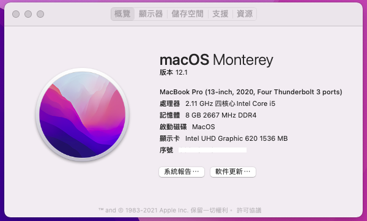

# OpenCore ACER A315-55G

__My Specs__

| Specs | Details |
|------------|-------------------------------|
| Model | Acer Aspire 3 A315-55G-51C1 |
| OS | macOS Big Sur && Windows 11  |
| CPU | Intel(R) Core(TM) i5 i5-10210U |
| RAM | 8 GB DDR4 2666MHz |
| iGPU | Intel UHD Graphics 620 |
| dGPU | NVIDIA GeForce MX230 |
| Wireless | Dell Wireless 1820A |
| Audio | ALC255 |

__Tested and working__

- [x] Intel UHD Graphics 620
- [x] USB
- [x] Webcam
- [x] LAN
- [x] Screen brightness
- [x] Battery status
- [x] Sleep/Wake
- [x] WiFi
- [x] Bluetooth
- [x] HDMI + HDMI Audio
- [x] Airdrop + Handoff
- [x] Audio + Headphone + Internal Mic
- [x] Keyboard with backlight (Some function keys not work)
- [x] iServices

__Not working__

- [ ] TouchPad with gestures
- [ ] NVIDIA GeForce MX230

## Guide

__BIOS Settings__

- Set Supervisor Password
- Disable Secure Boot

__OpenCore config__

- Follow these instructions to configure your OpenCore: https://dortania.github.io/OpenCore-Install-Guide/  
- ACPI Hotpatch: https://github.com/daliansky/OC-little  
- Audio layout ID 71

__Install MacOS__

- Create bootable USB: https://dortania.github.io/OpenCore-Install-Guide/installer-guide/  
- If you have problems installing Catalina or later. Install Mojave then you can update to newer version.

__USB Mapping__

- USB Mapping: https://github.com/corpnewt/USBMap

__Fix iServices__

- Fix iServices: https://dortania.github.io/OpenCore-Post-Install/universal/iservices.html

__Fix Dual Boot__

- Fix timezone: https://www.tonymacx86.com/threads/fix-incorrect-time-in-windows-osx-dual-boot.133719/  

__UEFI Secure Boot__
- Setting: https://tkkinn.gitbook.io/opencore-uefi-secureboot-guide/

## Credits

Thanks to Acidanthera, RehabMan, dortania, alexandred, daliansky
